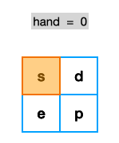

## 题目

随着兽群逐渐远去，一座大升降机缓缓的从地下升到了远征队面前。借由这台升降机，他们将能够到达地底的永恒至森。  
在升降机的操作台上，是一个由魔法符号组成的矩阵，为了便于辨识，我们用小写字母来表示。 `matrix[i][j]` 表示矩阵第 `i` 行 `j` 列的字母。该矩阵上有一个提取装置，可以对所在位置的字母提取。  
提取装置初始位于矩阵的左上角 `[0,0]`，可以通过每次操作移动到上、下、左、右相邻的 1 格位置中。提取装置每次移动或每次提取均记为一次操作。  

远征队需要按照顺序，从矩阵中逐一取出字母以组成 `mantra`，才能够成功的启动升降机。请返回他们 **最少** 需要消耗的操作次数。如果无法完成提取，返回 `-1`。

**注意：**
- 提取装置可对同一位置的字母重复提取，每次提取一个
- 提取字母时，需按词语顺序依次提取

**示例 1：**
>输入：`matrix = ["sd","ep"], mantra = "speed"`
>
>输出：`10`
>
>解释：如下图所示  


**示例 2：**
>输入：`matrix = ["abc","daf","geg"]， mantra = "sad"`
>
>输出：`-1`
>
>解释：矩阵中不存在 `s` ，无法提取词语

## 思路
1. BFS。
2. 状态为 $(i,j,k)$，表示当前位置在 $(i,j)$，**要去**提取 $\textit{mantra}[k]$。
3. 如果 $\textit{matrix}[i][j]=\textit{mantra}[k]$，则移动到状态 $(i,j,k+1)$。
4. 枚举周围四个格子，移动到状态 $(i',j',k)$。
3. 初始状态：$(0,0,0)$。
4. 终点为 $k=l$，这里 $l$ 为 $\textit{mantra}$ 的长度。


```go 
func extractMantra(matrix []string, mantra string) int {
	m, n := len(matrix), len(matrix[0])
	type pair struct {
		i, j, k int
	}
	q := []pair{pair{
		i: 0,
		j: 0,
		k: 0,
	}}
	vis := make(map[pair]bool)
	vis[q[0]] = true
	step := 1
	for len(q) > 0 {
		tmp := q
		q = nil
		for _, p := range tmp {
			i, j, k := p.i, p.j, p.k
			if matrix[i][j] == mantra[k] {
				if k == len(mantra)-1 {
					return step
				}
				newP := pair{
					i: i,
					j: j,
					k: k + 1,
				}
				if !vis[newP] {
					vis[newP] = true
					q = append(q, newP)
				}
			}
			for _, val := range [][]int{{i + 1, j}, {i - 1, j}, {i, j + 1}, {i, j - 1}} {
				x, y := val[0], val[1]
				if 0 <= x && x < m && 0 <= y && y < n {
					newP := pair{
						i: x,
						j: y,
						k: k,
					}
					if !vis[newP] {
						vis[newP] = true
						q = append(q, newP)
					}
				}
			}
		}
		step++
	}

	return -1
}
```

### 复杂度分析
- 时间复杂度：{O}(mnl)，其中 m 和 n 分别为 {matrix} 的行数和列数，l 为 {mantra} 的长度。
- 空间复杂度：{O}(mnl)。